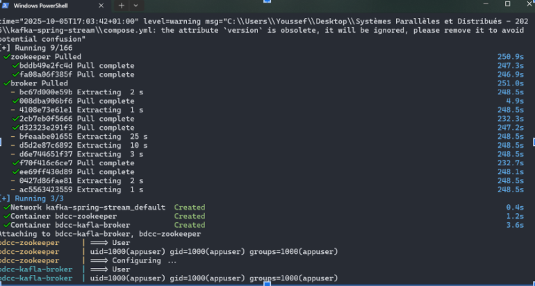
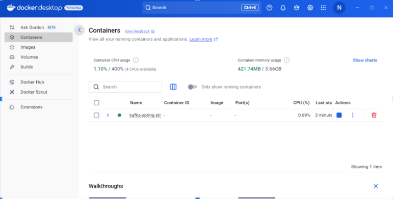
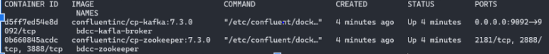
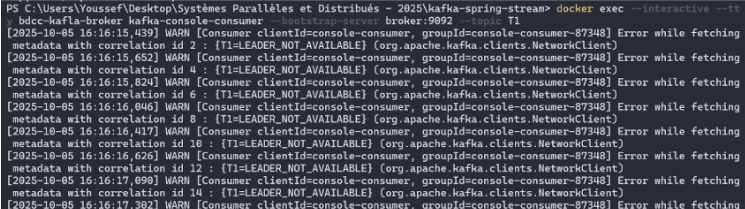
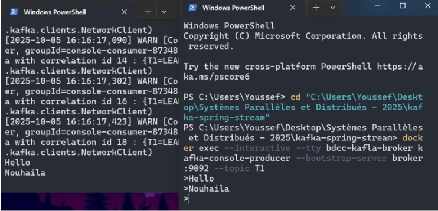
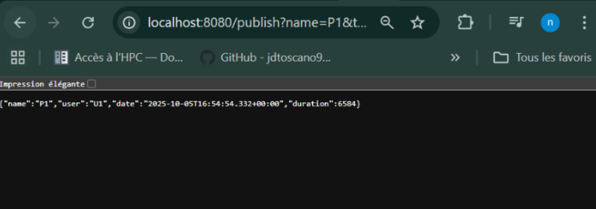
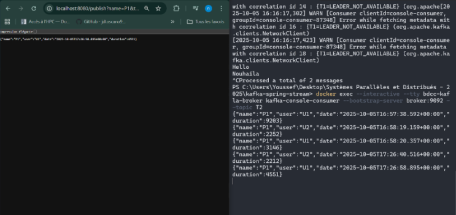
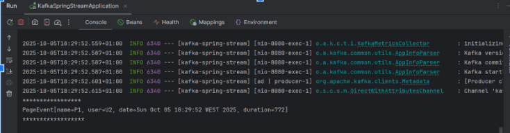
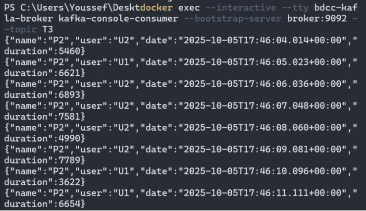
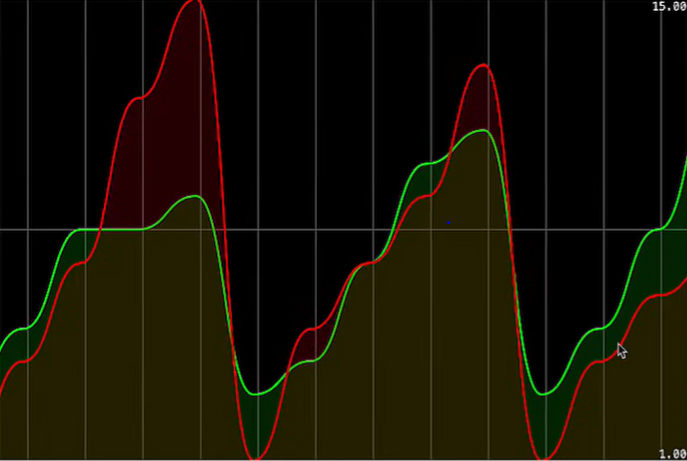

# 🧩 TP Kafka et Spring Cloud Stream

## 🎯 Objectif
Mettre en place un environnement Kafka (local ou Docker) et développer une architecture complète basée sur Spring Cloud Stream comprenant des services **Producer**, **Consumer**, **Supplier** et **Data Analytics Stream Processing**.

---

## 🚀 Partie 1 : Installation et Tests de Base

### 1. Installation de Kafka
- Télécharger Kafka  
- Démarrer **Zookeeper**
- Démarrer **Kafka Server**




---

## 🐳 Partie 2 : Utilisation avec Docker

### Étapes :
- Créer le fichier `docker-compose.yml`
- Démarrer les conteneurs :  
  ```bash
  docker-compose up -d



- Tester avec :
  - `kafka-console-producer`
  - `kafka-console-consumer`

---

## ⚙️ Partie 3 : Développement avec Spring Cloud Stream
- Services à créer :
- 📨 1. Service Producer Kafka
Créer un contrôleur REST permettant d’envoyer des messages à un topic Kafka.

- 📥 2. Service Consumer Kafka

Créer un microservice qui consomme les messages envoyés par le Producer.











- 🔁 3. Service Supplier Kafka
Créer un service générant automatiquement des messages vers Kafka (mode Supplier).


- 📊 4. Service de Data Analytics (Stream Processing)

Mettre en place un service Kafka Streams réalisant un traitement analytique en temps réel sur les données.


- 🌐 5. Application Web de Visualisation
Créer une interface web affichant en temps réel les résultats du Stream Data Analytics.



---

## 🧠 Résumé du TP

Ce TP permet de :

Maîtriser le fonctionnement de Kafka et des topics.

Déployer Kafka avec  Docker.

Construire une architecture d’échange de messages entre microservices.

Mettre en place un traitement analytique en temps réel.
